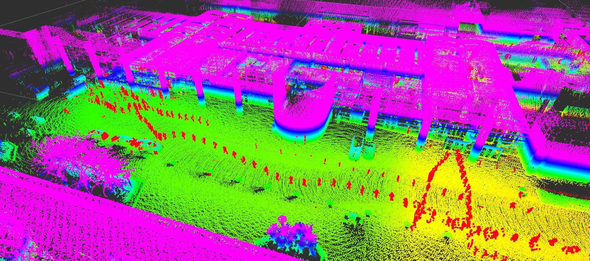
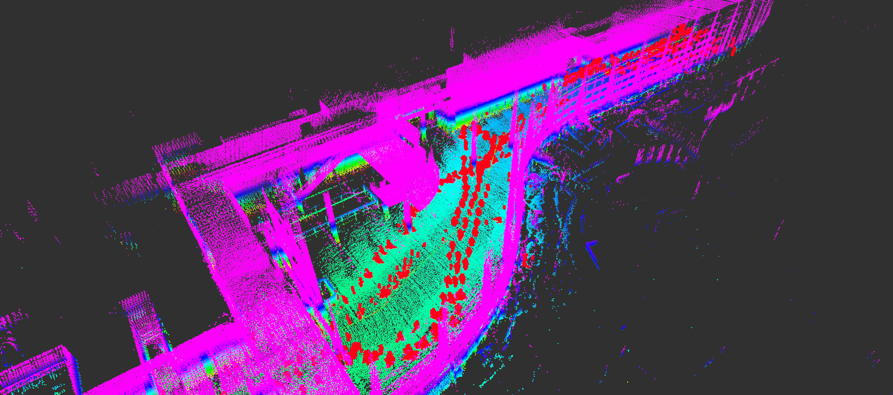
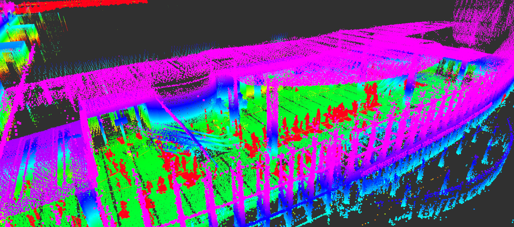
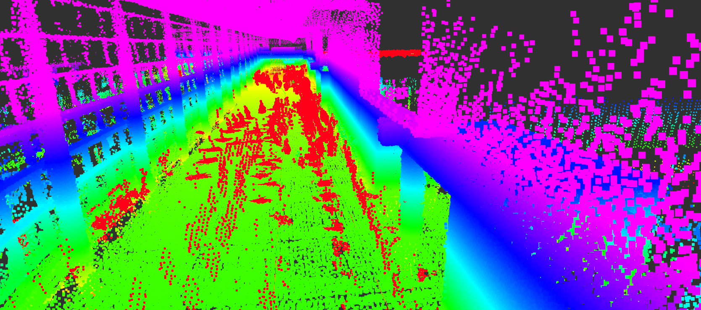

# :rainbow: ERASOR (RA-L'21 with ICRA Option)

This branch is for our lastmile project.

Online으로 mapping하기 위한 방법 정리

1. 일정 거리가 움직여야 node를 받아와서 맵을 쌓음 (흔히 사용하던 node manager 같이)
2. 어느 정도 node (N개)가 쌓이면 동적 물체 제거를 실행
3. ROS의 Timer를 활용해서 `save_duration`만큼 시간이 지나면 저장
4. 혹시 강제로 저장해야할 경우에는 

아래와 같이 `saveflag`를 날려서 저장할수 있도록 짜 둠

```bash
rostopic pub /saveflag std_msgs/Float32 "data: 0.2"

```
* "0.2" denotes voxelization size.

---

## How to run

```bash
$ roslaunch erasor run_erasor_in_your_env_ouster.launch pcd_output_path:=/home/shapelim/coex_est_map.pcd
```

**NOTE** `save_path`가 '~.pcd'가 아니면 에러나게 되어 있음 주의

---

## 데모에 필요한 파라미터들은 아래와 같이 정리해 둠!

* 하드웨어가 변경되지만 않으면 ERASOR의 파라미터는 따로 건드릴 부분 없음!

* Node관리 및 save 관련은 `ERASOR/config/your_own_env_ouster.yaml` 참조

``` 
deep_express:
    trans_diff_thr: 1.5 # unit: m
    rot_diff_thr: 15.0 # unit: deg
    sliding_window_size: 30 # I guess `trans_diff_thr` * `sliding_window_size` should be smaller than `submap_size`
    # Params for saving the pcd map    
    output_map_voxel_size: 0.3 
    save_duration: 200 # unit: sec.
```

---

## 결과










