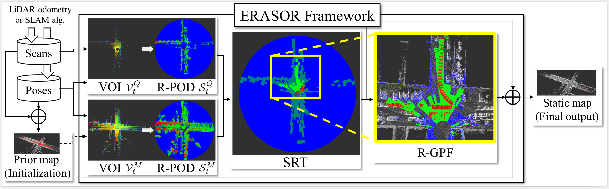
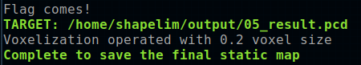
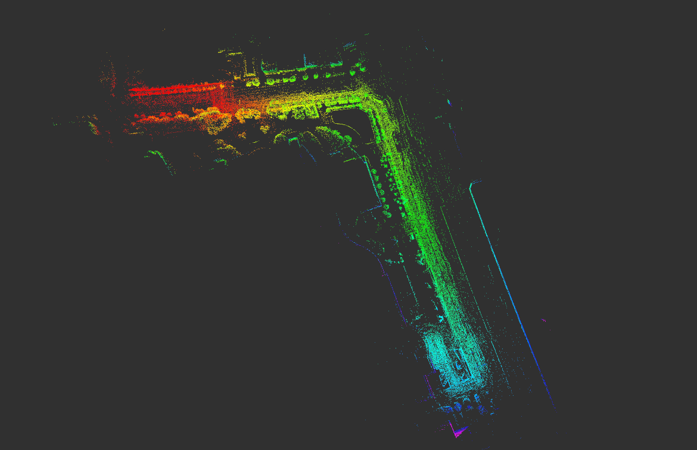

# :rainbow: ERASOR (RA-L'21 with ICRA Option)

Official page of [*"ERASOR: Egocentric Ratio of Pseudo Occupancy-based Dynamic Object Removal for Static 3D Point Cloud Map Building"*](https://ieeexplore.ieee.org/stamp/stamp.jsp?tp=&arnumber=9361109), which is accepted by RA-L with ICRA'21 option 
[[Video](https://www.youtube.com/watch?v=Nx27ZO8afm0)] [[Preprint Paper](https://arxiv.org/abs/2103.04316)] 




We provide all contents including

- [x] Source code of ERASOR
- [x] All outputs of the State-of-the-arts
- [x] Visualization
- [x] Calculation code of Preservation Rate/Rejection Rate

So enjoy our codes! :)

Contact: Hyungtae Lim (shapelim`at`kaist`dot`ac`dot`kr)

Advisor: Hyun Myung (hmyung`at`kaist`dot`ac`dot`kr)

## NEWS (Recent update: Oct., 2021) 
- An example of running ERASOR in your own env. is provided.
    - Please refer to please refer to `src/offline_map_updater/main_in_your_env.cpp` and `launch/run_erasor_in_your_env_vel16.launch`. The more details are  [here](#ERASOR-in-the-Wild).
---

## Contents
0. [Test Env.](#Test-Env.)
0. [Requirements](#requirements)
0. [How to Run ERASOR](#How-to-Run-ERASOR)
0. [Calculate PR/RR](#Calculate-PR/RR)
0. [Benchmark](#benchmark)
0. [Visualization of All the State-of-the-arts](#Visualization-of-All-the-State-of-the-arts)
0. [ERASOR in the Wild](#ERASOR-in-the-Wild)
0. [Citation](#citation)

## Test Env.
The code is tested successfully at
* Linux 18.04 LTS
* ROS Melodic

## Requirements

### ROS Setting
- Install [ROS](http://torch.ch/docs/getting-started.html) on a machine. 
- Also, [jsk-visualization](https://github.com/jsk-ros-pkg/jsk_visualization) is required to visualize Scan Ratio Test (SRT) status.

```bash
sudo apt-get install ros-melodic-jsk-recognition
sudo apt-get install ros-melodic-jsk-common-msgs
sudo apt-get install ros-melodic-jsk-rviz-plugins
```

#### Build Our Package 
- Thereafter, compile this package. We use [catkin tools](https://catkin-tools.readthedocs.io/en/latest/),
```bash
mkdir -p ~/catkin_ws/src
cd ~/catkin_ws/src
git clone https://github.com/LimHyungTae/ERASOR.git
cd .. && catkin build erasor 
```
 
### Python Setting
- Our metric calculation for PR/RR code is implemented by python2.7
- To run the python code, following pakages are necessary: [pypcd](https://github.com/dimatura/pypcd), [tqdm](https://github.com/tqdm/tqdm), [scikit-learn](https://scikit-learn.org/stable/), and [tabulate](https://pyneng.readthedocs.io/en/latest/book/12_useful_modules/tabulate.html)
```bash
pip install pypcd
pip install tqdm	
pip install scikit-learn
pip install tabulate
```
 
### Prepared dataset

- Download the preprocessed KITTI data encoded into rosbag.
- The downloading process might take five minutes or so. All rosbags requires total 2.3G of storage space
```bash
wget https://urserver.kaist.ac.kr/publicdata/erasor/rosbag/00_4390_to_4530_w_interval_2_node.bag
wget https://urserver.kaist.ac.kr/publicdata/erasor/rosbag/01_150_to_250_w_interval_1_node.bag
wget https://urserver.kaist.ac.kr/publicdata/erasor/rosbag/02_860_to_950_w_interval_2_node.bag
wget https://urserver.kaist.ac.kr/publicdata/erasor/rosbag/05_2350_to_2670_w_interval_2_node.bag
wget https://urserver.kaist.ac.kr/publicdata/erasor/rosbag/07_630_to_820_w_interval_2_node.bag
```
#### Description of Preprocessed Rosbag Files

- Please note that the rosbag consists of `node`. Refer to `msg/node.msg`.
- Note that each label of the point is assigned in `intensity` for the sake of convenience.
- And we set the following classes are dynamic classes:
```
# 252: "moving-car"
# 253: "moving-bicyclist"
# 254: "moving-person"
# 255: "moving-motorcyclist"
# 256: "moving-on-rails"
# 257: "moving-bus"
# 258: "moving-truck"
# 259: "moving-other-vehicle"
```
- Please refer to `std::vector<int> DYNAMIC_CLASSES` in our code :).

## How to Run ERASOR

We will explain how to run our code on seq 05 of the KITTI dataset as an example.

**Step 1. Build naive map**


* Set the following parameters in `launch/mapgen.launch`.
	* `target_rosbag`: The name of target rosbag, e.g. `05_2350_to_2670_w_interval_2_node.bag`
	* `save_path`: The path where the naively accumulated map is saved.
* Launch mapgen.launch and play corresponding rosbag on the other bash as follows:
```bash
roscore # (Optional)
roslaunch erasor mapgen.launch
rosbag play 05_2350_to_2670_w_interval_2_node.bag
```
* Then, dense map and voxelized map are auto-saved at the `save path`. Note that the dense map is used for evaluation to fill corresponding labels. The voxelized map will be an input of step 2 as a naively accumulated map.

**Step 2. Run ERASOR**

* Set the following parameters in `config/seq_05.yaml`.
	* `initial_map_path`: The path of naively accumulated map
	* `save_path`: The path where the filtered static map is saved.
  
* Run the following command for each bash.
```bash
roscore # (Optional)
roslaunch erasor run_erasor.launch target_seq:="05"
rosbag play 05_2350_to_2670_w_interval_2_node.bag
```
**News (22.03.01):** The submap module is employed to speed up when extracing map VOI.

Plase check the below rosparams in `run_erasor.launch`:
```
<rosparam param="/large_scale/is_large_scale">true</rosparam>
<rosparam param="/large_scale/submap_size">160.0</rosparam>
```

Note that appropriate `submap_size` is > 2 * max_range.

* **IMPORTANT:** After finishing running ERASOR, run the following command to save the static map as a pcd file on another bash.
* "0.2" denotes voxelization size.
```bash
rostopic pub /saveflag std_msgs/Float32 "data: 0.2"
```

* Then, you can see the printed command as follows:



* The results will be saved under the `save_path` folder, i.e. `$save_path$/05_result.pcd`.

## Calculate PR/RR

You can check our results directly.

* First, download all pcd materials.
```bash
wget https://urserver.kaist.ac.kr/publicdata/erasor/erasor_paper_pcds.zip
unzip erasor_paper_pcds.zip
```

Then, run the analysis code as follows:

```bash
python analysis.py --gt $GT_PCD_PATH$ --est $EST_PCD_PATH$
```

E.g, 

```bash
python analysis.py --gt /home/shapelim/erasor_paper_pcds/gt/05_voxel_0_2.pcd --est /home/shapelim/erasor_paper_pcds/estimate/05_ERASOR.pcd
```

**NOTE**: For estimating PR/RR, more dense pcd file, which is generated in the `mapgen.launch` procedure, is better to estimate PR/RR precisely.


## Benchmark


- Error metrics are a little bit different from those in the paper:
  
  | Seq.    |  PR [%] |  RR [%] |
  |-----------------------------|:-----:|:-----:|
  | 00  | 91.72 | 97.00 |
  | 01  | 91.93 | 94.63 |
  | 02  | 81.08 | 99.11 |
  | 05  | 86.98 | 97.88 |
  | 07  | 92.00 | 98.33 |
- But we provide all pcd files! Don't worry. See [Visualization of All the State-of-the-arts](#Visualization-of-All-the-State-of-the-arts) Section.

## Visualization of All the State-of-the-arts

* First, download all pcd materials.
```bash
wget https://urserver.kaist.ac.kr/publicdata/erasor/erasor_paper_pcds.zip
unzip erasor_paper_pcds.zip
```

* Set parameters in `config/viz_params.yaml` correctly
    * `abs_dir`: The absolute directory of pcd directory
    * `seq`: Target sequence (00, 01, 02, 05, or 07)
    
* After setting the parameters, launch following command:
```bash
roslaunch erasor compare_results.launch
```
* Then you can inspect all pcd results that are already parsed into static points and dynamic points.
* All examples are here:
    * [Sequence 00: 4,390~4,530](img/00)
    * [Sequence 01: 150~250](img/01)
    * [Sequence 02: 860~950](img/02)
    * [Sequence 05: 2,350~2,670](img/05)
    * [Sequence 07: 630~820](img/07)

## ERASOR in the Wild

### In your own dataset

To check generalization of ERASOR, we tested ERASOR in more crowded environments. In that experiment, Velodyne Puck 16 was employed, and poses are estimated by [LIO-SAM](https://github.com/TixiaoShan/LIO-SAM).

Satellite map                 |  Pcd map by LIO-SAM
:-------------------------:|:-------------------------:
 |  


When **running ERASOR in your own environments**, please refer to `src/offline_map_updater/main_in_your_env.cpp` file and `launch/run_erasor_in_your_env_vel16.launch`.

You can learn how to set experimental setting by repeating our pre-set configurations. Please follow our instructions.

* First, download pre-set dataset.
```
wget https://urserver.kaist.ac.kr/publicdata/erasor/bongeunsa_dataset.zip
unzip bongeunsa_dataset.zip
```

* Modify `data_dir`, `MapUpdater/initial_map_path`, and `MapUpdater/save_path` in `config/your_own_env_vel16.yaml` to be right directory for your machine, where `data_dir` should consist of following components as follows:

```
`data_dir`
_____pcds
     |___000000.pcd
     |___000001.pcd
     |___000002.pcd
     |...
_____dense_global_map.pcd
_____poses_lidar2body.csv
_____...
```

* Next, launch `launch/run_erasor_in_your_env_vel16.launch` as follows:

 
```
roslaunch erasor run_erasor_in_your_env_vel16.launch
```
### Results


### Note: Setting appropriate parameters

* As shown in `config`, depending on your own sensor configuration, parameters must be changed. In particular, `min_h` and `max_h`, and `th_bin_max_h` should be changed (note that `min_h` and `max_h`, and `th_bin_max_h` is w.r.t. your body frame of a query pcd file.) 
* If you use a low-channel LiDAR sensor such as Velodyne Puck-16, `max_r` and `num_rings` must be set as smaller values like `config/your_own_env_vel16.yaml` to guarantee the estimated normal vector for each bin is considered to be orthogonal to the ground.
* If too many points are considered as ground points for each bin, then reduce the value of `gf_dist_thr`.


## Citation 
If you use our code or method in your work, please consider citing the following:

	@article{lim2021erasor,
    title={ERASOR: Egocentric Ratio of Pseudo Occupancy-Based Dynamic Object Removal for Static 3D Point Cloud Map Building},
    author={Lim, Hyungtae and Hwang, Sungwon and Myung, Hyun},
    journal={IEEE Robotics and Automation Letters},
    volume={6},
    number={2},
    pages={2272--2279},
    year={2021},
    publisher={IEEE}
    }


