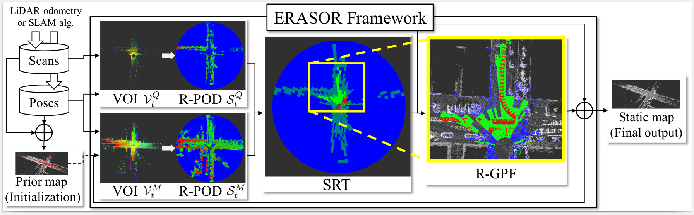
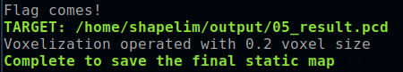
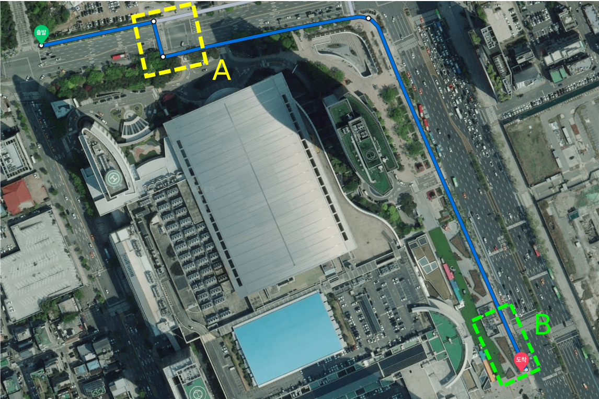
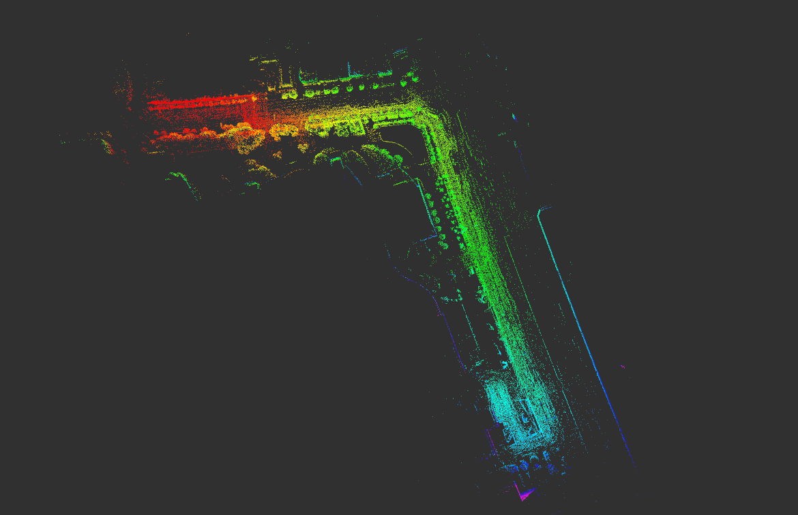

# :rainbow: ERASOR (RA-L'21 with ICRA Option)

Official page of [*"ERASOR: Egocentric Ratio of Pseudo Occupancy-based Dynamic Object Removal for Static 3D Point Cloud Map Building"*](https://ieeexplore.ieee.org/stamp/stamp.jsp?tp=&arnumber=9361109), which is accepted by RA-L with ICRA'21 option 
[[Video](https://www.youtube.com/watch?v=Nx27ZO8afm0)] [[Preprint Paper](https://arxiv.org/abs/2103.04316)] 




We provide all contents including

- [x] Source code of ERASOR
- [x] All outputs of the State-of-the-arts
- [x] Visualization
- [x] Calculation code of Preservation Rate/Rejection Rate

So enjoy our codes! :)

Contact: Hyungtae Lim (shapelim`at`kaist`dot`ac`dot`kr)

Advisor: Hyun Myung (hmyung`at`kaist`dot`ac`dot`kr)

## NEWS

- **2026-05**: Per-seq KITTI configs re-tuned against paper Table II; main-README and `scripts/semantickitti2bag/README.md` rewrites; expanded "ERASOR in the Wild" section with coordinate-frame cautions and a non-KITTI pitfall checklist.
- **2021-10**: An example of running ERASOR in your own env is provided — see `src/offline_map_updater/main_in_your_env.cpp` and `launch/run_erasor_in_your_env_vel16.launch`. Details under [ERASOR in the Wild](#ERASOR-in-the-Wild).
---

## Contents
0. [Test Env.](#Test-Env.)
0. [Requirements](#requirements)
0. [How to Run ERASOR](#How-to-Run-ERASOR)
0. [Calculate PR/RR](#Calculate-PR/RR)
0. [Benchmark](#benchmark)
0. [Visualization of All the State-of-the-arts](#Visualization-of-All-the-State-of-the-arts)
0. [ERASOR in the Wild](#ERASOR-in-the-Wild)
0. [Citation](#citation)

## Test Env.
The code is tested successfully at
* Linux 18.04 LTS
* ROS Melodic

## Requirements

### ROS Setting
- Install [ROS](http://torch.ch/docs/getting-started.html) on a machine. 
- Also, [jsk-visualization](https://github.com/jsk-ros-pkg/jsk_visualization) is required to visualize Scan Ratio Test (SRT) status.

```bash
sudo apt-get install ros-melodic-jsk-recognition
sudo apt-get install ros-melodic-jsk-common-msgs
sudo apt-get install ros-melodic-jsk-rviz-plugins
```

#### Build Our Package 
- Thereafter, compile this package. We use [catkin tools](https://catkin-tools.readthedocs.io/en/latest/),
```bash
mkdir -p ~/catkin_ws/src
cd ~/catkin_ws/src
git clone https://github.com/LimHyungTae/ERASOR.git
cd .. && catkin build erasor 
```
 
### Python Setting
- Our metric calculation for PR/RR code is implemented by python2.7
- To run the python code, following pakages are necessary: [pypcd](https://github.com/dimatura/pypcd), [tqdm](https://github.com/tqdm/tqdm), [scikit-learn](https://scikit-learn.org/stable/), and [tabulate](https://pyneng.readthedocs.io/en/latest/book/12_useful_modules/tabulate.html)
```bash
pip install pypcd
pip install tqdm	
pip install scikit-learn
pip install tabulate
```
 
### Prepared dataset

- Download the preprocessed KITTI data encoded into rosbag.
- The downloading process might take five minutes or so. All rosbags requires total 2.3G of storage space
```bash
wget https://urserver.kaist.ac.kr/publicdata/erasor/rosbag/00_4390_to_4530_w_interval_2_node.bag
wget https://urserver.kaist.ac.kr/publicdata/erasor/rosbag/01_150_to_250_w_interval_1_node.bag
wget https://urserver.kaist.ac.kr/publicdata/erasor/rosbag/02_860_to_950_w_interval_2_node.bag
wget https://urserver.kaist.ac.kr/publicdata/erasor/rosbag/05_2350_to_2670_w_interval_2_node.bag
wget https://urserver.kaist.ac.kr/publicdata/erasor/rosbag/07_630_to_820_w_interval_2_node.bag
```

> **NOTE!** The rosbags above assume that the per-frame poses are estimated by **SuMa** (Behley & Stachniss, RSS 2018). As stated in §III.A of the paper, "Maps are constructed at the regular intervals with the poses provided by SuMa, which contains inherent uncertainty." If you regenerate any bag from raw SemanticKITTI data via `scripts/semantickitti2bag/`, copy `sequences/<seq>/poses_suma_optim.txt` to `sequences/<seq>/poses.txt` first so that `pykitti.odometry.load_poses()` picks up the SuMa poses; otherwise the resulting map will not align with the shipped ground-truth PCDs.

#### Description of Preprocessed Rosbag Files

- Please note that the rosbag consists of `node`. Refer to `msg/node.msg`.
- Note that each label of the point is assigned in `intensity` for the sake of convenience.
- And we set the following classes are dynamic classes:
```
# 252: "moving-car"
# 253: "moving-bicyclist"
# 254: "moving-person"
# 255: "moving-motorcyclist"
# 256: "moving-on-rails"
# 257: "moving-bus"
# 258: "moving-truck"
# 259: "moving-other-vehicle"
```
- Please refer to `std::vector<int> DYNAMIC_CLASSES` in our code :).

## How to Run ERASOR

We will explain how to run our code on seq 05 of the KITTI dataset as an example.

**Step 1. Build naive map**


* Set the following parameters in `launch/mapgen.launch`.
	* `target_rosbag`: The name of target rosbag, e.g. `05_2350_to_2670_w_interval_2_node.bag`
	* `save_path`: The path where the naively accumulated map is saved.
* Launch mapgen.launch and play corresponding rosbag on the other bash as follows:
```bash
roscore # (Optional)
roslaunch erasor mapgen.launch
rosbag play 05_2350_to_2670_w_interval_2_node.bag
```
* Then, dense map and voxelized map are auto-saved at the `save path`. Note that the dense map is used for evaluation to fill corresponding labels. The voxelized map will be an input of step 2 as a naively accumulated map.

**Step 2. Run ERASOR**

* Set the following parameters in `config/seq_05.yaml`.
	* `initial_map_path`: The path of naively accumulated map
	* `save_path`: The path where the filtered static map is saved.
  
* Run the following command for each bash.
```bash
roscore # (Optional)
roslaunch erasor run_erasor.launch target_seq:="05"
rosbag play 05_2350_to_2670_w_interval_2_node.bag
```
**News (22.03.01):** The submap module is employed to speed up when extracing map VOI.

Plase check the below rosparams in `run_erasor.launch`:
```
<rosparam param="/large_scale/is_large_scale">true</rosparam>
<rosparam param="/large_scale/submap_size">160.0</rosparam>
```

Note that appropriate `submap_size` is > 2 * max_range.

* **IMPORTANT:** After finishing running ERASOR, run the following command to save the static map as a pcd file on another bash.
* "0.2" denotes voxelization size.
```bash
rostopic pub /saveflag std_msgs/Float32 "data: 0.2"
```

* Then, you can see the printed command as follows:



* The results will be saved under the `save_path` folder, i.e. `$save_path$/05_result.pcd`.

## Calculate PR/RR

You can check our results directly.

* First, download all pcd materials.
```bash
wget https://urserver.kaist.ac.kr/publicdata/erasor/erasor_paper_pcds.zip
unzip erasor_paper_pcds.zip
```

Then, run the analysis code as follows:

```bash
python analysis.py --gt $GT_PCD_PATH$ --est $EST_PCD_PATH$
```

E.g, 

```bash
python analysis.py --gt /home/shapelim/erasor_paper_pcds/gt/05_voxel_0_2.pcd --est /home/shapelim/erasor_paper_pcds/estimate/05_ERASOR.pcd
```

**NOTE**: For estimating PR/RR, more dense pcd file, which is generated in the `mapgen.launch` procedure, is better to estimate PR/RR precisely.


## Benchmark

We re-ran the current master branch on the five SemanticKITTI snippets shipped with this repo (after re-tuning `config/seq_{00,02}.yaml`) and compared the resulting Preservation Rate (PR), Rejection Rate (RR), and F1 against the original Table II of the paper. **Bold** marks the higher value per cell.

| Seq | Frames | PR [%] ( $\color{#c026d3}\textsf{paper}$ / $\color{#0969da}\textsf{ours}$ ) | RR [%] ( $\color{#c026d3}\textsf{paper}$ / $\color{#0969da}\textsf{ours}$ ) | F1 ( $\color{#c026d3}\textsf{paper}$ / $\color{#0969da}\textsf{ours}$ ) |
|-----|--------|---|---|---|
| 00 | 4390 – 4530 | $\color{#c026d3}93.980$ / $\color{#0969da}\mathbf{95.790}$ | $\color{#c026d3}\mathbf{97.081}$ / $\color{#0969da}95.642$ | $\color{#c026d3}0.955$ / $\color{#0969da}\mathbf{0.957}$ |
| 01 |  150 –  250 | $\color{#c026d3}91.487$ / $\color{#0969da}\mathbf{91.890}$ | $\color{#c026d3}\mathbf{95.383}$ / $\color{#0969da}94.777$ | $\color{#c026d3}\mathbf{0.934}$ / $\color{#0969da}0.933$ |
| 02 |  860 –  950 | $\color{#c026d3}\mathbf{87.731}$ / $\color{#0969da}87.136$ | $\color{#c026d3}97.008$ / $\color{#0969da}\mathbf{99.337}$ | $\color{#c026d3}0.921$ / $\color{#0969da}\mathbf{0.928}$ |
| 05 | 2350 – 2670 | $\color{#c026d3}\mathbf{88.730}$ / $\color{#0969da}88.589$ | $\color{#c026d3}98.262$ / $\color{#0969da}\mathbf{98.328}$ | $\color{#c026d3}\mathbf{0.933}$ / $\color{#0969da}0.932$ |
| 07 |  630 –  820 | $\color{#c026d3}90.624$ / $\color{#0969da}\mathbf{93.876}$ | $\color{#c026d3}\mathbf{99.271}$ / $\color{#0969da}98.875$ | $\color{#c026d3}0.948$ / $\color{#0969da}\mathbf{0.963}$ |

<sub>$\color{#c026d3}\textsf{Magenta}$ = paper (Table II), $\color{#0969da}\textsf{blue}$ = our re-run on the current master commit. Both columns are evaluated against the dense semantic ground-truth map shipped in `erasor_paper_pcds/gt/<seq>_voxel_0_2.pcd` at a 0.2 m voxel size using `scripts/analysis_runner.py`. Each "ours" run uses a freshly mapgen-built accumulated map as `initial_map_path` so that the initial map sits in the same coordinate frame as the paper GT.</sub>

- We also provide all pcd files. See [Visualization of All the State-of-the-arts](#Visualization-of-All-the-State-of-the-arts) below.

## Visualization of All the State-of-the-arts

* First, download all pcd materials.
```bash
wget https://urserver.kaist.ac.kr/publicdata/erasor/erasor_paper_pcds.zip
unzip erasor_paper_pcds.zip
```

* Set parameters in `config/viz_params.yaml` correctly
    * `abs_dir`: The absolute directory of pcd directory
    * `seq`: Target sequence (00, 01, 02, 05, or 07)
    
* After setting the parameters, launch following command:
```bash
roslaunch erasor compare_results.launch
```
* Then you can inspect all pcd results that are already parsed into static points and dynamic points.
* All examples are here:
    * [Sequence 00: 4,390~4,530](img/00)
    * [Sequence 01: 150~250](img/01)
    * [Sequence 02: 860~950](img/02)
    * [Sequence 05: 2,350~2,670](img/05)
    * [Sequence 07: 630~820](img/07)

## ERASOR in the Wild

### In your own dataset

To check generalization of ERASOR, we tested ERASOR in more crowded environments. In that experiment, Velodyne Puck 16 was employed, and poses are estimated by [LIO-SAM](https://github.com/TixiaoShan/LIO-SAM).

Satellite map                 |  Pcd map by LIO-SAM
:-------------------------:|:-------------------------:
 |  


When **running ERASOR in your own environments**, refer to `src/offline_map_updater/main_in_your_env.cpp` and `launch/run_erasor_in_your_env_vel16.launch`. The non-KITTI driver reads per-frame point clouds + a CSV of poses (instead of a rosbag of `node` messages) and feeds them to the same `OfflineMapUpdater`.

You can learn how to set things up by reproducing our pre-set configuration first:

```bash
wget https://urserver.kaist.ac.kr/publicdata/erasor/bongeunsa_dataset.zip
unzip bongeunsa_dataset.zip
```

#### 1. Input layout

Modify `data_dir`, `MapUpdater/initial_map_path`, and `MapUpdater/save_path` in `config/your_own_env_vel16.yaml` to point at your dataset. `data_dir` must contain:

```
<data_dir>/
├── pcds/
│   ├── 000000.pcd          # per-frame LiDAR scan (in the LiDAR's own frame)
│   ├── 000001.pcd
│   └── ...
├── dense_global_map.pcd    # naively-accumulated map you want ERASOR to clean
└── poses_lidar2body.csv    # one pose per frame (see format below)
```

`poses_lidar2body.csv` has **one header line** and one comma-separated row per frame. Each row has at least 9 columns; only columns 3–9 are used (0-indexed: `pose[2..8]`):

```
<ignored>, <ignored>, x, y, z, qx, qy, qz, qw
```

Indices 0–1 are reserved (we use them for timestamp / frame index but they aren't read). The CSV is parsed in `main_in_your_env.cpp` at `load_all_poses()`.

> ❗ **NOTE — what the poses must represent.** The CSV name is historical and misleading. Each row is **`T_map_from_lidar`** — i.e. the transformation that takes a point in the LiDAR frame *of that specific scan* and places it directly into the map frame. Concretely, `pose_i · pcds/00000<i>.pcd` must overlay correctly on `dense_global_map.pcd`. Verify this before tuning anything else (an easy sanity check is to load the dense map and one transformed scan in CloudCompare or RViz — the static structures should overlay to within a few centimetres).

#### 2. `tf/lidar2body` and the body frame

`OfflineMapUpdater` exposes a separate `tf/lidar2body` extrinsic in the yaml (7 floats: `[x, y, z, qx, qy, qz, qw]`). It is applied to every query scan *before* the egocentric VoI is extracted:

```
body_cloud = tf_lidar2body · lidar_cloud
map_cloud  = pose_i · body_cloud           # implicit: pose_i must be T_map_from_body in this convention
```

Two valid conventions:

| Convention | `poses_lidar2body.csv` contains | `tf/lidar2body` should be |
|---|---|---|
| (A) "bake the offset into the poses" *(what the bongeunsa example uses)* | `T_map_from_lidar` (already includes the LiDAR-to-body offset, since body == lidar for ERASOR's purposes) | **identity** = `[0, 0, 0, 0, 0, 0, 1]` |
| (B) "keep poses in body frame" | `T_map_from_body` | the actual LiDAR-to-body extrinsic of your robot |

> ❗ **NOTE — body frame defines `min_h` / `max_h`.** ERASOR's vertical thresholds (`min_h`, `max_h`, `th_bin_max_h`) are measured **in the body frame after `tf/lidar2body` is applied**. If your body frame's Z axis points up and Z = 0 sits at the LiDAR mount, then for a robot whose LiDAR is 1.6 m above the ground, you want `min_h ≈ -1.6` (ground level) and `max_h ≈ 1.5` (head clearance). If the resulting static map is tilted, shifted, or you see *no* ground retrieval, the most likely cause is a mismatch in convention (A vs B) — pick one and stick to it.

#### 3. Launch

```bash
roslaunch erasor run_erasor_in_your_env_vel16.launch
```

The launch file loads `config/your_own_env_vel16.yaml`, starts `main_in_your_env_ros`, and opens two RViz views. After the last frame is processed the static map is saved to `~/staticmap_via_erasor.pcd`.

### Results


<details>
<summary><b>📐 Setting appropriate parameters (per-sensor tuning notes — click to expand)</b></summary>

* **Per-sensor geometry** — depending on the LiDAR you use, `max_range`, `num_rings`, and `num_sectors` need to be changed so that each angular bin still contains enough points to fit a ground plane. For a low-channel LiDAR (e.g. Velodyne Puck-16), use small values similar to `config/your_own_env_vel16.yaml` (`max_range: 9.5`, `num_rings: 8`, `num_sectors: 60`); for 64-channel SemanticKITTI we use 60–80 m, 15–20 rings, 60–108 sectors.
* **Vertical thresholds** — set `min_h` / `max_h` to your body-frame VoI extents (see §2 above) and tune `th_bin_max_h` (a height delta above the per-bin ground) to whatever stops dynamic-but-tall obstacles from being reverted as ground. Typical values are 0.05 – 0.20 m.
* **Ground filter** — if too many points are classified as ground, reduce `gf_dist_thr` (the plane-fit inlier distance). If the ground filter misses obvious flat ground, raise it.
* **Aggressiveness** — `scan_ratio_threshold` is the single most impactful knob (higher = more aggressive removal). Sweep it over `{0.10, 0.15, 0.20, 0.25, 0.30}` and pick the F1 maximum; lowering also helps when you see static points being deleted (false positives). The KITTI configs in `config/seq_*.yaml` are a calibrated starting point per environment type (intersection, highway, countryside).
* **Intensity carries the label.** The pipeline assumes each input point's `intensity` field encodes the SemanticKITTI semantic label (`uint32` reinterpreted as `float32`). If you only want the static map output and don't care about PR/RR, set `intensity = 0` everywhere — ERASOR will still run, but `scripts/analysis_runner.py` won't have ground-truth labels to compare against.

</details>


<details>
<summary><b>⚠️ Common pitfalls when bringing your own data (click to expand)</b></summary>

1. **Wrong pose convention** → static map appears rotated or offset by tens of metres. Sanity-check by overlaying `pose_0 · pcds/000000.pcd` on `dense_global_map.pcd` in CloudCompare. Most points should sit within `0.5 × voxel_size` of the dense map (see `scripts/analysis_runner.py` for an automated overlap check we use on KITTI).
2. **Mismatched units** between the dense map (`.pcd`) and the per-frame scans (e.g. one is in meters, the other in millimetres). All inputs must be in metres.
3. **`pcds/` indices not starting at 0 / not contiguous.** The driver reads `pcds/000000.pcd`, `000001.pcd`, … sequentially. Missing frames will be skipped silently. Use `--init_idx N` if your sequence starts later.
4. **Labels in `intensity` get cast incorrectly.** ERASOR stores `uint32` labels inside a `float32` field via byte reinterpretation. If you write the labels as a float number (e.g. `intensity = 252.0` for a moving car), the C++ side will not parse the label — encode them via `np.float32(np.uint32(label).view(np.float32))` (see `scripts/semantickitti2bag/README.md`).
5. **Dense map and scans use different lidar-to-body offsets.** If your dense map was accumulated by an external SLAM (e.g. LIO-SAM) using a slightly different extrinsic than the one you put in `tf/lidar2body`, the input/output frames disagree. Re-run mapgen with the same extrinsic the live pipeline will see.

</details>


## Citation 
If you use our code or method in your work, please consider citing the following:

	@article{lim2021erasor,
    title={ERASOR: Egocentric Ratio of Pseudo Occupancy-Based Dynamic Object Removal for Static 3D Point Cloud Map Building},
    author={Lim, Hyungtae and Hwang, Sungwon and Myung, Hyun},
    journal={IEEE Robotics and Automation Letters},
    volume={6},
    number={2},
    pages={2272--2279},
    year={2021},
    publisher={IEEE}
    }


